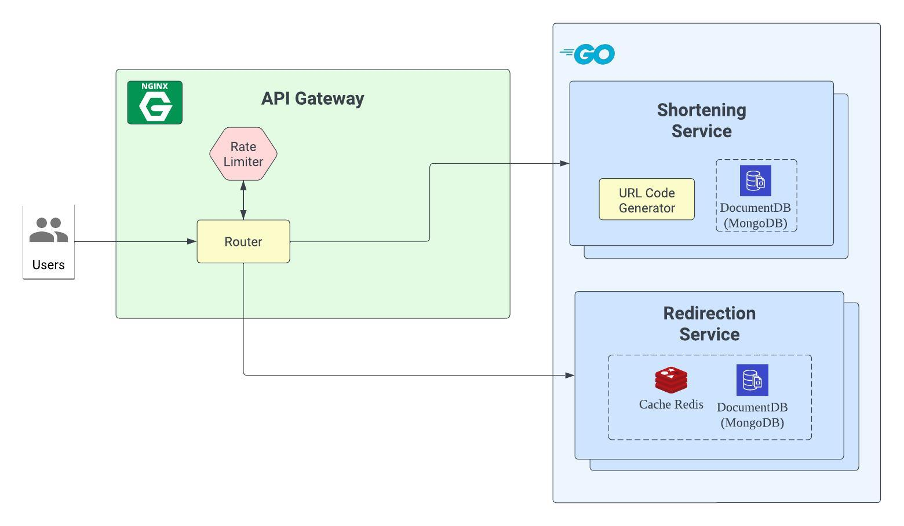
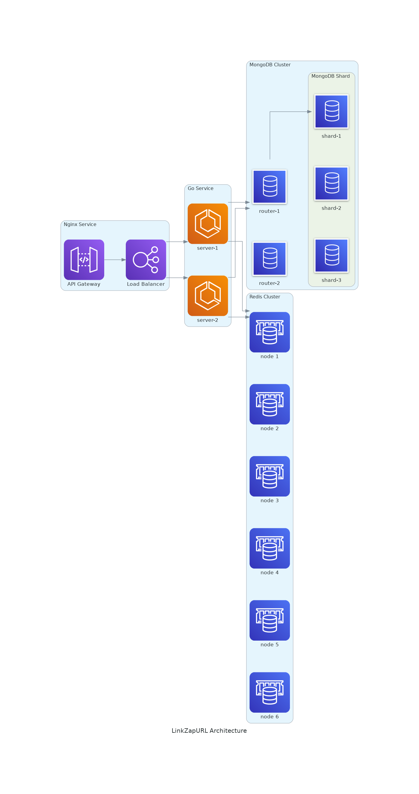

# linkZapURL - System Design for URL Shortener Service

## Table of Contents
- [Introduction](#introduction)
- [Features](#features)
- [Architecture](#architecture)
  - [High Level Design](#high-level-design)
  - [Final Architecture](#final-architecture)
- [API Sequence Diagram](#api-sequence-diagram)
    - [Shortening Service](#shortening-service)
    - [Redirection Service](#redirection-service)
- [Tech Stack](#tech-stack)
- [Run](#run)
- [Endpoints](#endpoints)
  - [Swagger](#swagger)
  - [linkZapURL Service](#linkzapurl-service)

## Introduction
linkZapURL is a URL shortening service. It is a simple service that takes a long URL and returns a short URL. When a user visits the short URL, it will redirect to the long URL.

## Features
- Horizontal scalability (sharding, unique ID generator)
- Snowflake ID (timestamp + machineID + sequence) as unique ID
- Cache (including non-exist codes' requests)
- base58 encoding

## Architecture

### High Level Design


### Final Architecture
All of the services are deployed in local machine for demonstration purpose. In production, the services should be deployed in different physical or virtual machines.



## API Sequence Diagram
### Shortening Service


### Redirection Service


## Tech Stack
- [MongoDB](https://www.mongodb.com/): database, shard
- [Redis](https://redis.io/): cache, cluster
- [Docker](https://www.docker.com/): container
- [Docker Compose](https://docs.docker.com/compose/): container orchestration
- [gin](https://github.com/gin-gonic/gin)
- [nginx](https://www.nginx.com/): reverse proxy

## Run
My environment: WSL2
```bash
# Start MongoDB
cd ./docker/mongodb && ./init.sh && cd ../..
# Start Redis
cd ./docker/redis && ./init.sh && cd ../..
# Start Nginx
cd ./docker/nginx && ./init.sh && cd ../..
# Start Service
./init.sh
# Host: http://localhost
```

### Configurations
See [config.yaml](./docker/config.yaml).

## Endpoints

### [Swagger](./docs/swagger.json)
- `GET /swagger/index.html`

### linkZapURL Service
- `POST /api/v1/shorten`

    Request Body:
    ```json
    {
        "url": "<original_url>",
        "expireAt": "<expired_time>" // format: RFC3339
    }
    ```
    
    Response Body:
    ```json
    {
        "id": "<code>",
        "shortUrl": "http://localhost/<code>"
    }
    ```
- `GET /:code`

   Redirect to the original URL
