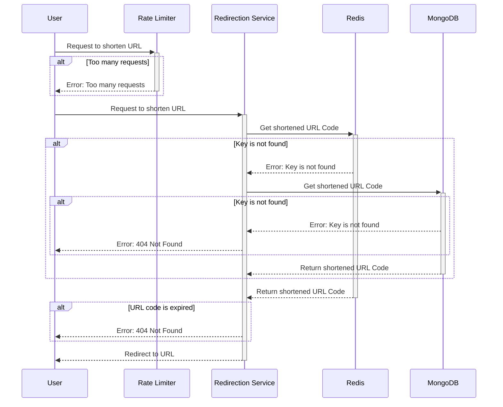

```mermaid
sequenceDiagram
    participant User
    participant Rate Limiter
    participant Redirection Service
    participant Redis
    participant MongoDB
    User->>+Rate Limiter: Request to shorten URL
    alt Too many requests
        Rate Limiter-->>-User: Error: Too many requests
    end
    User->>+Redirection Service: Request to shorten URL
    Redirection Service->>+Redis: Get shortened URL Code
    alt Key is not found
        Redis-->>Redirection Service: Error: Key is not found
        Redirection Service->>+MongoDB: Get shortened URL Code
        alt Key is not found
            MongoDB-->>Redirection Service: Error: Key is not found
            Redirection Service-->>User: Error: 404 Not Found
        end
        MongoDB-->>-Redirection Service: Return shortened URL Code
    end
    Redis-->>-Redirection Service: Return shortened URL Code
    alt URL code is expired
        Redirection Service-->>User: Error: 404 Not Found
    end
    Redirection Service-->>-User: Redirect to URL
```