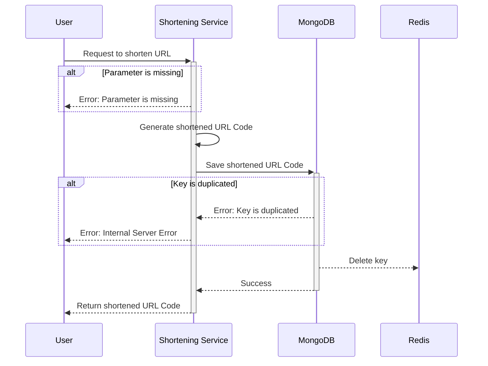

```mermaid
sequenceDiagram
    participant User
    participant Shortening Service
    participant MongoDB
    participant Redis
    User->>+Shortening Service: Request to shorten URL
    alt Parameter is missing
        Shortening Service-->>User: Error: Parameter is missing
    end
    Shortening Service->>Shortening Service: Generate shortened URL Code
    Shortening Service->>+MongoDB: Save shortened URL Code
    alt Key is duplicated
        MongoDB-->>Shortening Service: Error: Key is duplicated
        Shortening Service-->>User: Error: Internal Server Error
    end
    MongoDB-->>Redis: Delete key
    MongoDB-->>-Shortening Service: Success
    Shortening Service-->>-User: Return shortened URL Code
```